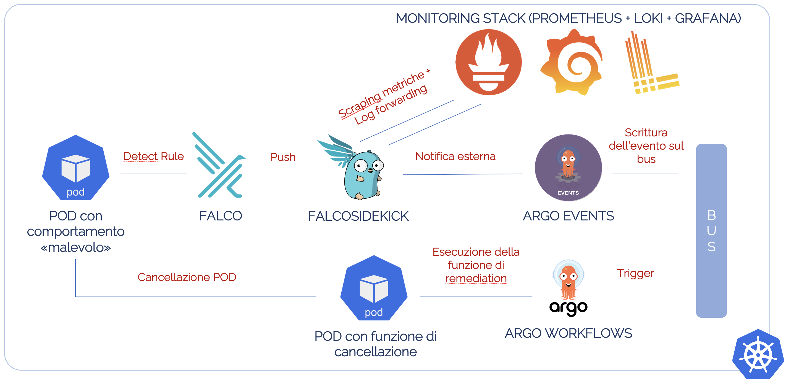

# Osservabilità e Sicurezza ai tempi dei container: vediamoci chiaro con un approccio Cloud Native (CloudConf2022, Torino)
https://2022.cloudconf.it/schedule.html
## Architettura della Demo


Riferimento originale: https://falco.org/blog/falcosidekick-response-engine-part-5-argo/ 

## Come riprodurre la Demo
### Prerequisito
Avere un cluster Kubernetes funzionante (es. su VM Ubuntu)

```shell
sudo apt-get -y install build-essential linux-headers-$(uname -r) virtualbox docker.io
sudo systemctl enable --now docker
sudo usermod -aG docker ubuntu

curl -LO https://storage.googleapis.com/minikube/releases/latest/minikube-linux-amd64
sudo install minikube-linux-amd64 /usr/local/bin/minikube

curl https://baltocdn.com/helm/signing.asc | sudo apt-key add -
sudo apt-get install apt-transport-https --yes
echo "deb https://baltocdn.com/helm/stable/debian/ all main" | sudo tee /etc/apt/sources.list.d/helm-stable-debian.list
sudo apt-get update
sudo apt-get install helm

curl -LO "https://dl.k8s.io/release/$(curl -L -s https://dl.k8s.io/release/stable.txt)/bin/linux/amd64/kubectl"
sudo install -o root -g root -m 0755 kubectl /usr/local/bin/kubectl

minikube start --cpus=4 --memory=16384 --kubernetes-version=1.24.3 --driver=virtualbox --network-plugin=cni --cni=cilium
```

### Installazione dell'architettura
```shell
git clone https://github.com/Vista-Technology/CloudConf2022-Torino.git

cd CloudConf2022-Torino

./init.sh
```
Link alla dashboard Grafana della community per i dati Falco: https://grafana.com/grafana/dashboards/15310-falco-dashboard/ 

### Creazione dei sensori
Falco rule per intercettare le connessioni verso vistatech.it dal container
```shell
kubectl apply -f argo/sensor-nertwork.yaml -n argo-events
```

Falco rule per intercettare l'esecuzione di una shell dentro il container
```shell
kubectl apply -f argo/sensor-shell.yaml -n argo-events
```

### Deploy del POD di test
```shell
kubectl apply -f nginx.yaml
```